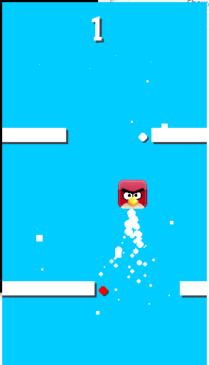

# CAP2-Pygame
Introducing 'Angry Wall': Navigate way for character with an iconic Angry Bird face as walls decend from above. Move left and right to avoid crashing and collect points by grabbing falling white balls.



## Requirements

Use the package manager [pip](https://pip.pypa.io/en/stable/) to install following packages :-
* Pygame

```bash
pip install pygame
```

## Usage

Navigate and click main.py to open the game, click anywhere to start the game. The objective of the game is to create high score without touching the fallng walls & red balls.

Controls:
* Click the bird and drag left & right. 

## Features

- Sprite Rendering
- Collision Detection
- Sound and Animation
- Particle Effects

## Contribution

Pull requests are welcome. For major changes, please open an issue first to discuss what you would like to change.

Please make sure to update tests as appropriate.
